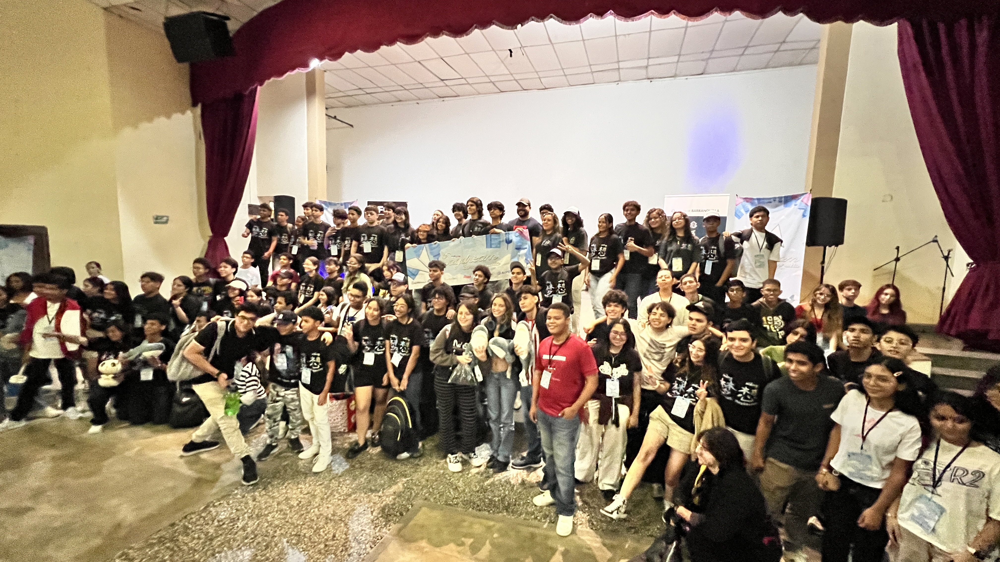
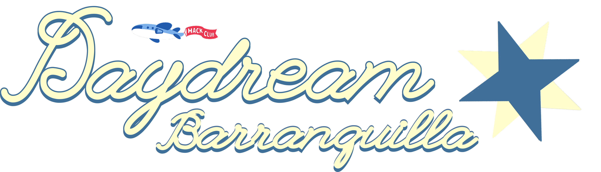
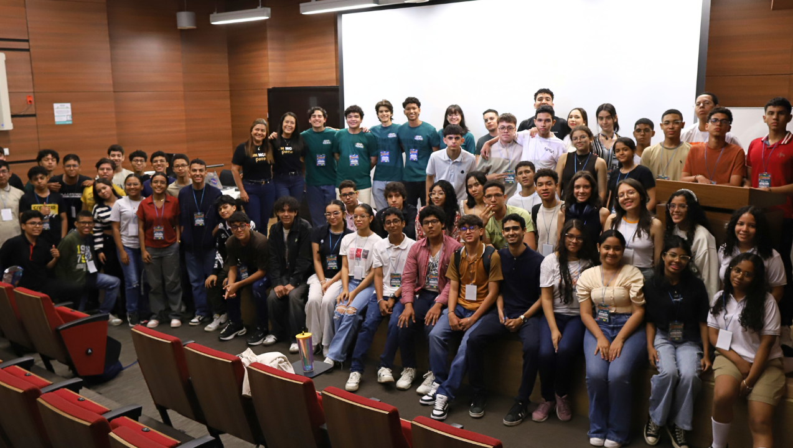
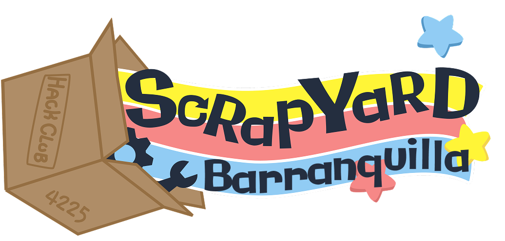
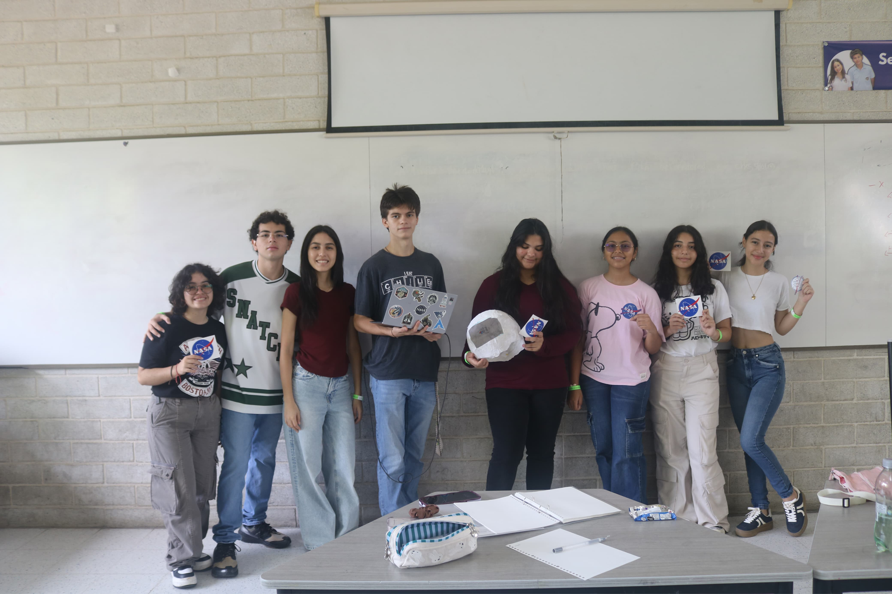
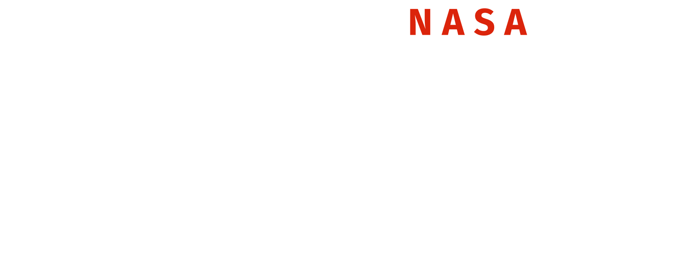

<h1 align="center">
  <br>
  <a href="https://icarusclub.org"></a>
  <br>
  Icarus Club
  <br>
</h1>

<h4 align="center">
Un club tecnológico de estudiantes en Barranquilla, Colombia
</h4>

<div align="center">


</div>

<p align="center">
  <a href="#sobre-nosotros">Sobre Nosotros</a> •
  <a href="#logros">Logros</a> •
  <a href="#tecnologías">Tecnologías</a> •
  <a href="#desarrollo">Desarrollo</a> •
  <a href="#contacto">Contacto</a> •
  <a href="#licencia">Licencia</a>
</p>


## Sobre Nosotros

**Icarus Club** es un club de tecnología con sede en Barranquilla, Colombia, liderado por estudiantes que formamos parte de [Hack Club](https://hackclub.com). Nuestro objetivo es hacer que participen niños de toda Colombia y mostrar a Barranquilla como la **capital de la tecnología** para niños y jóvenes del futuro.

### ¿Qué Hacemos?

- 🎮 **Hackathons**: Organizamos eventos donde jóvenes crean proyectos tecnológicos
- 💻 **Talleres**: Enseñamos programación, diseño y desarrollo
- 🤝 **Comunidad**: Conectamos a estudiantes apasionados por la tecnología
- 🚀 **Innovación**: Fomentamos la creatividad y el pensamiento crítico

## Logros

### Daydream Barranquilla



Organizamos **Daydream Barranquilla**, un hackathon de 24 horas junto a la Universidad Reformada y la Alcaldía de Barranquilla, donde los estudiantes crearon videojuegos en un día. ¡Fue el **más grande de América** y **4to a nivel mundial**!



### Scrapyard



Hemos organizado otros hackathons como **Scrapyard**, un hackathon con más de **100 participantes**, realizado el 15 de marzo de 2025 en la Universidad del Norte. Fue el **primer** hackathon para jóvenes del Caribe Colombiano.



### NASA Space Apps Challenge



Además, fuimos **finalistas internacionales** en el **NASA Space Apps Challenge 2024**, representando a nuestra ciudad ante la NASA.



## Tecnologías

Este sitio web está construido con:

- **[Next.js](https://nextjs.org/)** - Framework de React
- **[TypeScript](https://www.typescriptlang.org/)** - Tipado estático
- **[Tailwind CSS](https://tailwindcss.com/)** - Estilos utilitarios
- **[Theme UI](https://theme-ui.com/)** - Sistema de diseño
- **[@hackclub/theme](https://www.npmjs.com/package/@hackclub/theme)** - Tema de Hack Club

## Desarrollo

### Prerrequisitos

- Node.js 18+ instalado
- npm o yarn

### Instalación

```bash
# Clonar el repositorio
git clone https://github.com/NotARoomba/icarusclub.org.git

# Entrar al directorio
cd icarusclub.org

# Instalar dependencias
npm install

# Ejecutar en desarrollo
npm run dev
```

El sitio estará disponible en `http://localhost:3000`

### Comandos

```bash
npm run dev      # Modo desarrollo
npm run build    # Construir para producción
npm run start    # Iniciar servidor de producción
npm run lint     # Ejecutar ESLint
```

## Estructura del Proyecto

```
icarusclub.org/
├── src/
│   ├── app/
│   │   ├── page.tsx        # Página principal
│   │   ├── layout.tsx      # Layout principal
│   │   └── globals.css     # Estilos globales
│   └── components/
│       ├── ImageStrip.tsx  # Componente de logos animados
│       └── ProfileCard.tsx # Tarjetas de perfil de líderes
├── public/
│   ├── icarus/            # Imágenes de eventos
│   ├── leaders/           # Fotos de líderes
│   ├── sponsors/          # Logos de patrocinadores
│   └── logos/             # Logos de Icarus Club
└── README.md
```

## Requisitos para Unirse

- ✅ Ser un ser vivo
- 🎓 Ser estudiante de bachillerato
- 🇨🇴 Vivir en **Colombia**
- 🚀 Tener ganas de aprender y **hacer locuras**

### ¿Cómo Unirse?

Visita nuestro [formulario de registro](https://dashboard.hackclub.com/join-club?code=8INYUEJL) y únete a la revolución tecnológica en el Caribe!

## Aliados

Nuestras actividades están financiadas y apoyadas por diversas organizaciones y empresas. Si quieres ser parte de nuestros aliados, ¡escríbenos!

## Contacto

- 📧 Email: [contacto@icarusclub.org](mailto:contacto@icarusclub.org)
- 🌐 Sitio Web: [icarusclub.org](https://icarusclub.org)
- 💼 Dashboard: [Hack Club Dashboard](https://dashboard.hackclub.com/join-club?code=8INYUEJL)
- 💰 Finanzas: [HCB Transparencia](https://hcb.hackclub.com/icarus-club/transactions)

## Créditos

Este proyecto fue creado con:

- [Next.js](https://nextjs.org/)
- [Tailwind CSS](https://tailwindcss.com/)
- [Theme UI](https://theme-ui.com/)
- [Hack Club](https://hackclub.com/)
- Mucho ❤️ y café ☕

## Licencia

MIT

---

> [icarusclub.org](https://icarusclub.org) &nbsp;&middot;&nbsp;
> GitHub [@NotARoomba](https://github.com/NotARoomba) &nbsp;&middot;&nbsp;
> Email [contacto@icarusclub.org](mailto:contacto@icarusclub.org)
